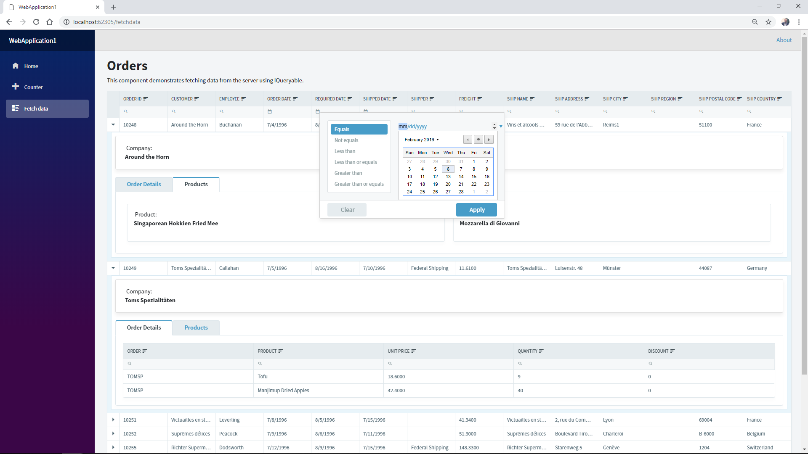

A [Razor Components](https://docs.microsoft.com/en-us/aspnet/core/razor-components/components?view=aspnetcore-3.0) sample application showing the power of Radzen Razor Components. 

More info about [Blazor 0.8.0 experimental release](https://blogs.msdn.microsoft.com/webdev/2019/02/05/blazor-0-8-0-experimental-release-now-available/). To run the application you need [Northwind database](https://docs.microsoft.com/en-us/dotnet/framework/data/adonet/sql/linq/downloading-sample-databases) and [Visual Studio 2019 Preview](https://visualstudio.microsoft.com/vs/preview/).

For bugs, feature requests or any other questions please use our [forum](http://forum.radzen.com/) or send an email to info@radzen.com